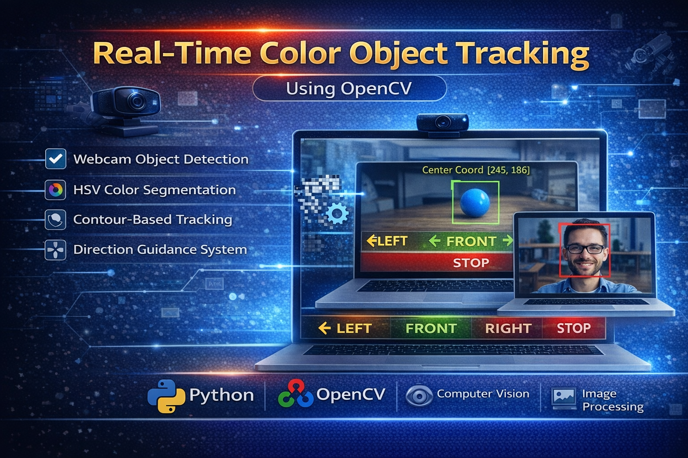

  

# Real-Time Color Object Tracking using OpenCV

## 📌 Project Overview
This project implements a **real-time color object detection and tracking system** using Python and OpenCV. The system detects a colored object through a webcam and provides directional commands such as **Left, Right, Front, and Stop** based on the object's position and size.

This type of system can be used in:
- Autonomous robots
- Smart navigation systems
- Computer vision applications
- AI-based robotics projects

---

## 🚀 Features
- Real-time webcam object detection
- HSV color space segmentation
- Contour-based object tracking
- Direction guidance system
- Noise reduction using morphological operations

---

## 🛠 Technologies Used
- Python
- OpenCV
- Computer Vision
- Image Processing

---
## ⚙ Installation

Clone the repository : https://github.com/selvan-01/color-object-tracking-opencv.git

pip install -r requirements.txt

Run the project : python color_object_tracking.py

---

## 🎯 Future Improvements

- Multi-object tracking
- Integration with robotics hardware
- AI-based object detection
- Object distance estimation

---
## 🔗 Links

- 💼 [LinkedIn](https://www.linkedin.com/in/senthamil45)
- 🌍 [Portfolio](https://senthamill.vercel.app/)
- 💻 [GitHub](https://github.com/selvan-01/color-object-tracking-opencv.git)

## 👨‍💻 Author

Senthamil Selvan  
Computer Science Engineer  
AI | Data Science | Computer Vision
